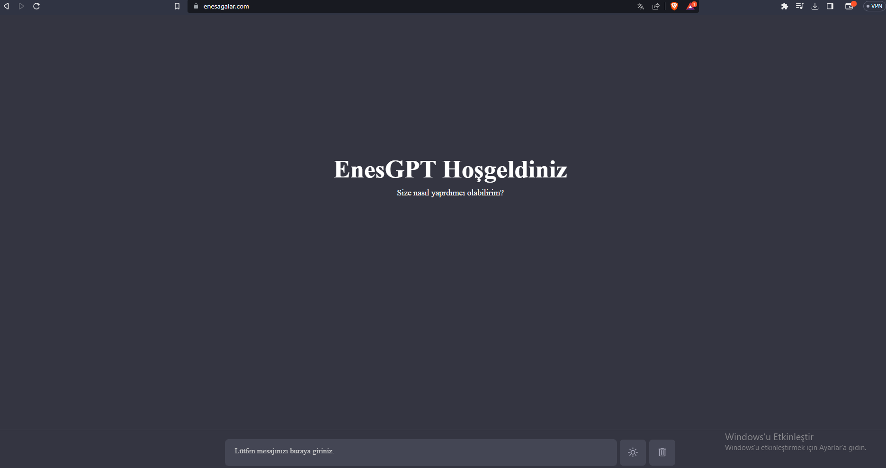

# GPT-3 Tabanlı Chat Uygulaması

Bu proje, OpenAI tarafından geliştirilen GPT-3 dil modelini kullanarak kullanıcılarla metin tabanlı bir sohbet deneyimi sunan bir web uygulamasıdır.



## Nasıl Çalışır?

Bu uygulama, OpenAI GPT-3.5 dil modelini kullanarak kullanıcı girişlerini anlamaya ve onlara yanıt vermeye dayanır. Kullanıcı, metin tabanlı bir arayüz üzerinden uygulamaya sorular sorabilir, talimatlar verebilir veya sohbet edebilir.

## Özellikler

- GPT-3 dil modeli sayesinde gerçekçi ve anlamlı yanıtlar sağlar.
- Basit ve kullanıcı dostu arayüzü sayesinde herkesin kolayca kullanabileceği bir deneyim sunar.
- Esnek ve genişletilebilir tasarım, uygulamayı farklı projelerde kullanmak için uyarlanabilir kılar.

## Nasıl Kullanılır?

1. **Uygulamayı İndirme**
   - Bu uygulamayı bilgisayarınıza indirin veya GitHub üzerinden klonlayın:

     ```
     git clone https://github.com/enesagalar/GPT-Chat-Uygulamasi.git
     ```

2. **Tarayıcıda Çalıştırma**
   - Uygulamayı çalıştırmak için herhangi bir modern web tarayıcısı kullanın.
   - İndirdiğiniz klasörde yer alan `index.html` dosyasını tarayıcınızla açın.

3. **API Anahtarı**
   - Bu uygulamayı çalıştırmak için OpenAI GPT-3 API anahtarına ihtiyacınız vardır.
   - API anahtarınızı `app.js` dosyasında belirtin:

     ```javascript
     const API_KEY = "YOUR_OPENAI_API_KEY";
     ```

4. **Uygulamayı Kullanma**
   - Uygulama başladıktan sonra, metin tabanlı bir arayüz görüntülenecektir.
   - Uygulamaya metin yazarak sorular sorabilir veya sohbet edebilirsiniz.

## Katkıda Bulunma

Eğer bu projeye katkıda bulunmak isterseniz, lütfen şu adımları takip edin:

1. Fork (Çatallama) yapın.
2. Yeni bir branch (dallanma) oluşturun.
3. Yaptığınız değişiklikleri commit (kaydet) edin.
4. Branch'inize push (gönderme) yapın.
5. Pull Request (Çekme İsteği) gönderin.


## İletişim

Herhangi bir soru veya öneriniz için bana e-posta gönderebilirsiniz: enesagalar@gmail.com

---
Geliştirici: Enes AĞALAR